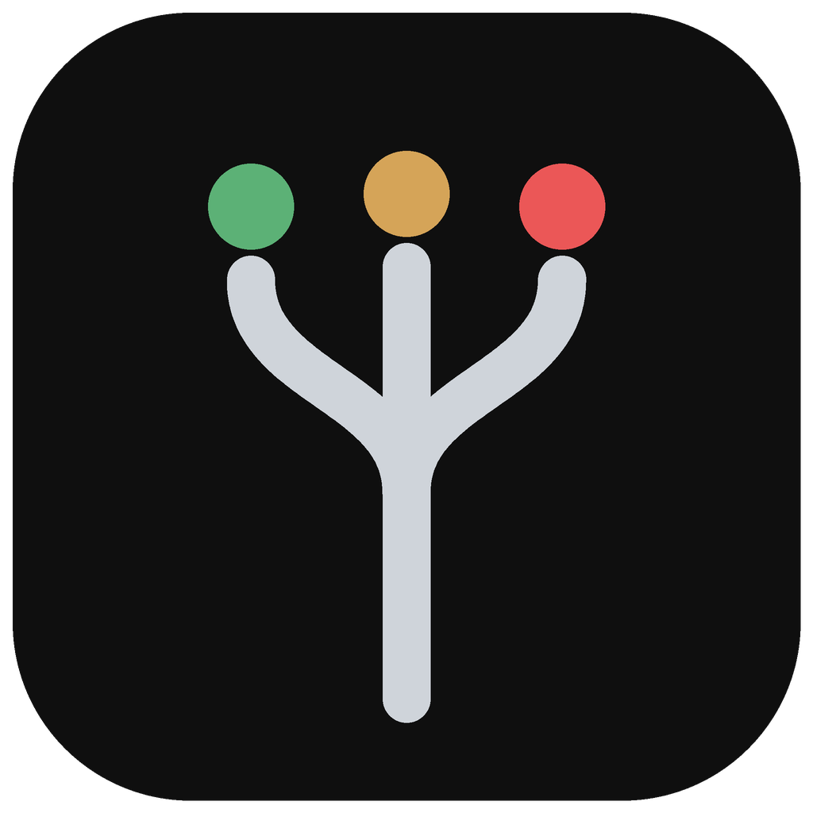
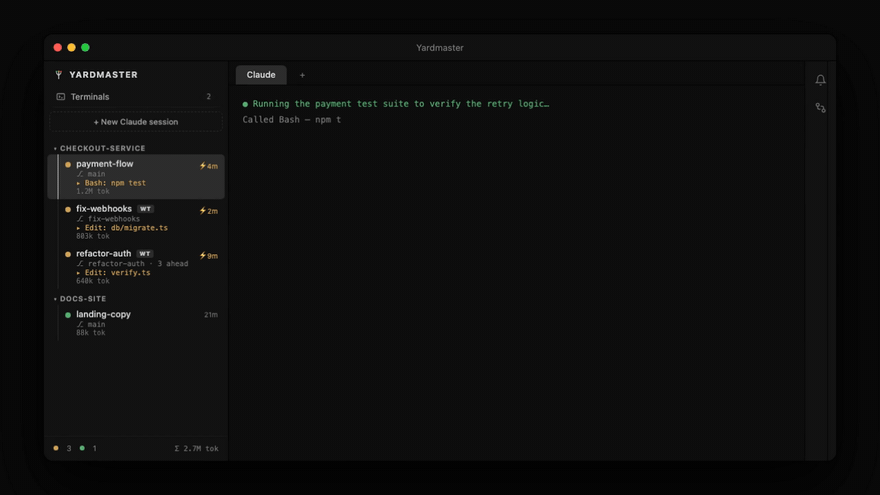

<p align="center">
  
</p>

<h1 align="center">Yardmaster</h1>

<p align="center">The Claude-native terminal for macOS.<br/>
One terminal to manage all your Claude terminals.</p>

<p align="center">
  
</p>

<p align="center">
  <a href="https://yardmaster.me/promo.mp4">▶ 25-second demo with sound</a> ·
  <a href="https://yardmaster.me">yardmaster.me</a> ·
  <a href="https://github.com/blothecap/yardmaster/releases">releases</a>
</p>

---

Most devs now run several Claude Code sessions at once — and their terminal has no
idea. A Claude that's been working for 20 minutes, a Claude waiting for permission,
and a dead pane all look like the same rectangle of text. Yardmaster is a macOS
terminal where Claude sessions are first-class: named, grouped by project, with
live status you can trust — because it speaks Claude Code's own hook protocol
instead of guessing from output.

## Features

- **Sessions sidebar** — named sessions grouped under their project, each row
  showing the live **git branch**, an activity line (the exact tool running right
  now — `▸ Bash: npm test` — or the waiting question), a working timer, and a
  **token meter** (`803k tok`, `1.2M tok`) that survives app restarts. Status dots
  are driven by Claude Code **hooks**, never output-scraping: working / needs-you /
  idle / exited.
- **Waiting-on-you inbox** (`⌘E`) — every blocked session with the exact question
  it's asking; jump to it, or **approve/deny right from the list** (`a` / `d`).
- **Worktree sessions** — one click gives a session its own isolated git worktree
  (`repo/.worktrees/<branch>`); run several Claudes on one repo in parallel. The
  **Changes pane** shows each session's diff and commits with one-click **merge**
  (guarded, conflict-safe) or **push + PR** (via `gh`).
- **Fork Session** — right-click a session to duplicate its entire conversation
  into a fresh worktree branched from the session's HEAD. Try a risky approach —
  or two competing ones — without gambling your accumulated context.
- **Real terminals, plural** — `⌘T` opens a login-shell tab beside any Claude
  session (as many as you want, `⌘⌥←/→` to switch, `⌘W` to close), and a
  standalone **Terminals** workspace makes it a plain multi-tab terminal — no
  Claude required. Scrollback survives tab flips and reloads via replay buffers.
- **Drag & drop** — drop files from Finder onto any pane and their quoted paths
  are typed at the cursor.
- **Notifications** — macOS notification + dock badge when a background session
  finishes or needs input; idle reminders are filtered out so red always means red.
- **Session persistence** — sessions survive app restarts and resume their
  conversations via `claude --resume`; per-session CLI flags (e.g. `--model opus`)
  persist with them.
- **Project panel** — the active project's dirty-file count, commits ahead of
  base, and last commit, always visible at the bottom of the sidebar.
- **In-app updates** — the app checks GitHub releases (one anonymous API call —
  there is no telemetry) and updates itself with one click; or check manually via
  the menu.

## Keyboard shortcuts

| Shortcut | Action |
|---|---|
| `⌘N` | New session (project pre-fillable from a group header's `+` / `⎇` buttons) |
| `⌘1…9` | Jump to session by position |
| `⌘J` / `⌘K`, `⌘↓` / `⌘↑`, `⌘⇧]` / `⌘⇧[` | Next / previous (includes the Terminals workspace) |
| `⌘E` | Waiting-on-you inbox (`a` approve / `d` deny) |
| `⌘T` | New terminal tab in the active session / workspace |
| `⌘⌥←` / `⌘⌥→` | Switch between the Claude tab and terminal tabs |
| `⌘W` | Close the active terminal tab (never the Claude session) |
| `⌘R` | Rename session |
| `⌘B` | Toggle sidebar |

## Install

Requirements: macOS on Apple silicon, Xcode Command Line Tools. Node and even
Claude Code itself are installed automatically if missing.

```sh
curl -fsSL https://yardmaster.me/install.sh | bash
```

or via Homebrew (prebuilt, instant — `--no-quarantine` skips Gatekeeper on this
unsigned build):

```sh
brew install --cask --no-quarantine blothecap/tap/yardmaster
```

The curl script clones this repo to `~/yardmaster`, checks prerequisites, builds, and
installs to /Applications (first build takes a few minutes). After that the app
updates itself — or re-run the one-liner any time. A prebuilt (unsigned) DMG is
on the [releases page](https://github.com/blothecap/yardmaster/releases); after
installing it, clear Gatekeeper's quarantine with
`xattr -cr /Applications/Yardmaster.app`.

For development: `nvm use && npx -y npm@11 install && npm run dev`
(`npm run dist` builds the app bundle; the app single-instance-locks, so close a
dev instance before launching the packaged one).

Quality gates: `npm test` (195 Vitest tests — the session state machine,
git/worktree operations, and persistence run against pty fakes and real temp git
repos), `npm run typecheck`, and `docs/smoke-checklist.md` for the manual pass.

## How it works

Electron, three layers. The **main process** owns everything: a `SessionManager`
state machine over node-pty processes, and a loopback **hook server** that
injected Claude Code hooks (`SessionStart` / `UserPromptSubmit` / `PreToolUse` /
`Notification` / `Stop`) call via per-session `--settings` files. That's the core
trick: status is *known*, not guessed — `PreToolUse` powers the live tool
heartbeat, `Notification` carries the exact permission question into the inbox,
`Stop` triggers token metering from the transcript. Around that sit git/worktree/
review modules and atomic `sessions.json` persistence. The **renderer** is a
dumb React UI over xterm.js panes (one per session, kept alive across switches
with replay buffers). A typed `window.api` contextBridge is the only seam
between them.

Nothing leaves your machine: no accounts, no telemetry, no cloud — the only
network calls are Claude Code's own and an anonymous GitHub version check.

The design/spec history lives in `docs/superpowers/` — the app was built
spec-first with per-task adversarial review, working with Claude. The first
working version took two days.

## License

[Apache-2.0](LICENSE) — free to use, modify, and redistribute; includes an
explicit patent grant. Copyright 2026 Blothecap.
